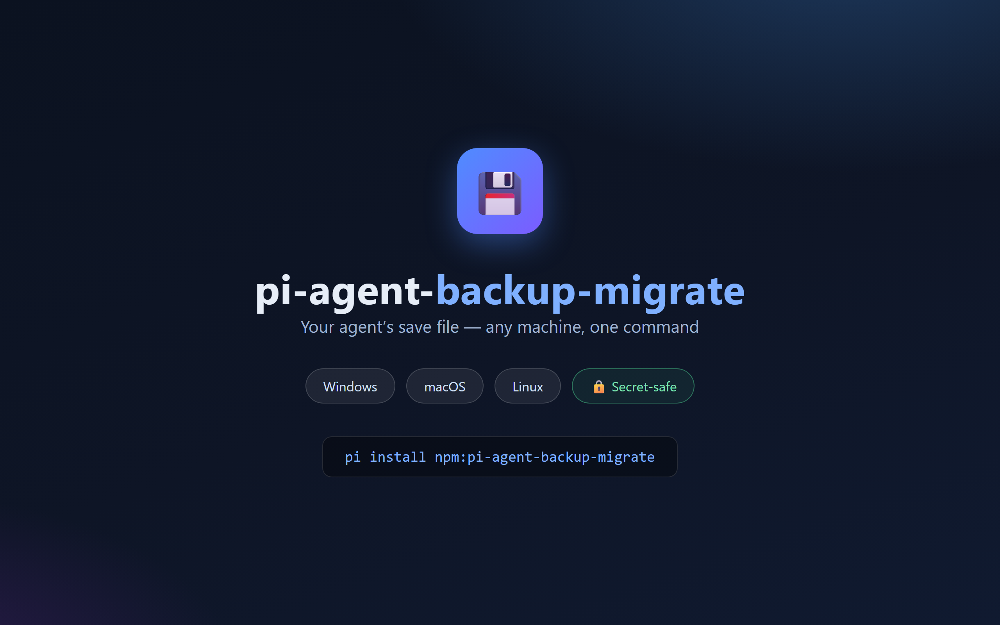

# pi-agent-backup-migrate

[](https://www.npmjs.com/package/pi-agent-backup-migrate)
[](https://www.npmjs.com/package/pi-agent-backup-migrate)



Backup, restore, and migrate the complete pi coding agent state across machines.

**Agents remember. Machines change. Keep your save file with you.**

## What it does

Packages the "soul" of your pi setup into a single self-contained tarball:

| Included | Excluded (by design) |
|---|---|
| `pi-hermes-memory/` long-term memory | `auth.json` (API keys — never packaged) |
| `projects-memory/` project memory | `*.env` (skill/extension secrets) |
| `sessions/` full conversation archive | `npm/` `bin/` (platform binaries, recreated on install) |
| `skills/` `extensions/` | sqlite lock files |
| `settings.json` `models-store.json` | |

The package is **self-contained**: it includes the restore script and an automatically generated migration checklist, so a fresh machine only needs the tarball.

## Install

```bash
pi install git:github.com/fengfanfan-max/pi-agent-backup-migrate
```

Or clone and use the script directly: `scripts/pi-agent-backup.sh`.

## Usage

```bash
# On the current machine: create a backup (data + checklist + restore script)
bash pi-agent-backup.sh backup

# Transfer the tarball via USB / AirDrop / private NAS / scp only.
# NEVER upload to public clouds — sessions/ contains private conversations.

# On the new machine: extract, then restore
tar xzf pi-agent-backup-*.tar.gz
bash ~/pi-agent-backup.sh restore pi-agent-backup-*.tar.gz
```

The restore command prints the generated migration checklist and runs live checks:
auth.json missing → `/login` again; `bin/` missing → reinstall binary-dependent skills.

## Security rules (enforced by the script)

- API keys (`auth.json`, `*.env`) are **never** packaged; each machine logs in via `/login`
- Sessions contain PII — private transport only (USB/AirDrop/NAS/SSH), never public GitHub
- No bidirectional cloud sync of `~/.pi/agent` (SQLite WAL lock conflicts)

## Requirements

- bash (Git Bash on Windows, system bash on macOS/Linux)
- tar

## License

MIT
